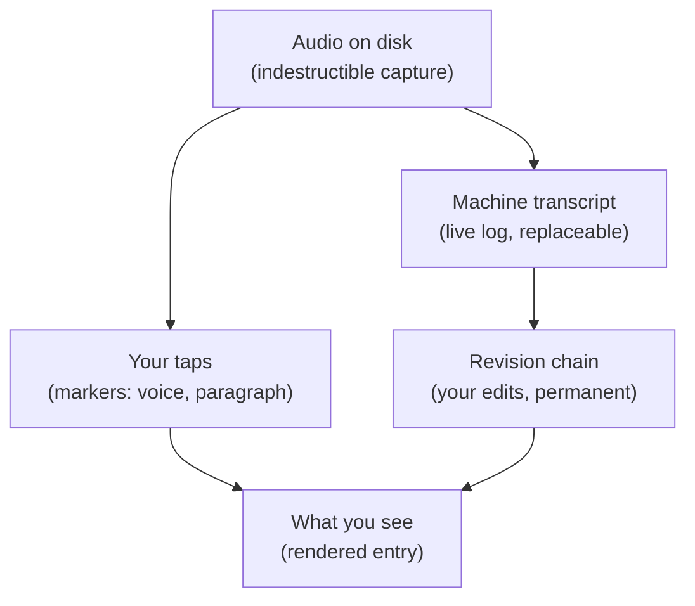
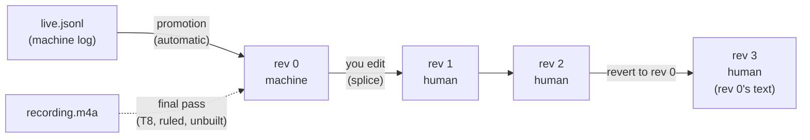
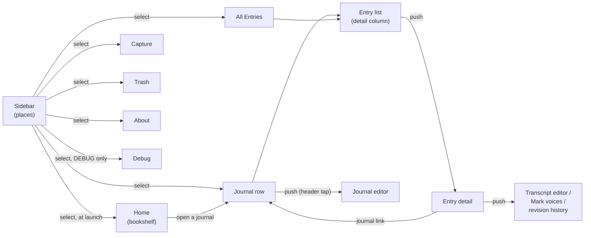

# Raconte — how it works (current plan, plain words)

A map of the system as it stands and where it's going. Mental models only — the
reasoning and history live in the linked design docs. Updated 2026-09-07.

## The one idea

**The audio file is the truth. Everything else — transcript, dates, voices,
paragraphs — is an interpretation of it, and every interpretation can be redone
without losing anything a human did.**

Every design choice below is that idea applied to one more layer.

## The layers



- Lower layers never depend on upper ones. A transcription bug can't hurt audio;
  a rendering bug can't hurt an edit.
- Machine output is always replaceable. Human input (edits, taps, dates) is never
  overwritten by a machine.

## 1. A capture: recording that survives anything

While you record, raw audio is appended to disk in ~20-second chunks. Kill the
app at any instant and at most the last unflushed buffer (≤ 0.2 s) is lost.
When you stop, the chunks are encoded to one `recording.m4a`, and the raw chunks
are deleted only after the m4a is verified playable. If encoding ever fails, the
raw chunks stay — they're playable themselves.

On every launch, a recovery scan walks the capture folders and finishes whatever
was interrupted. Nothing real is ever auto-deleted; you get a "Recovered
recording" banner with Keep as the default.

**The master clock is the frame count** — the running tally of audio samples
since recording began. Marker taps, transcript timestamps, and playback position
all use it, so "second 42 of the transcript" is literally second 42 of the m4a.

Details: [M1 capture design](plans/2026-07-29-m1-capture-design.md)

## 2. An entry: a capture plus your metadata

An entry is a capture directory plus a small `entry.json` sidecar holding what
*you* said about it: which journal it belongs to, its date, whether it's in the
trash, whether it's a two-voice entry. The sidecar is deliberately a separate
file so metadata edits can never disturb the hardened recording machinery.
A missing sidecar just means "all defaults" — never an error.

One capture directory, complete:

```
captures/<id>/                     # id is a ULID — sorts by creation time
  manifest.json                    #   machine state: format, phase, transcript ref
  entry.json                       #   your state: journal, date, trash, voices
  final/recording.m4a              #   the audio — the ground truth
  segments/…                       #   raw chunks (only until encoding finishes)
  transcript/
    live.jsonl                     #   what the machine heard, as it heard it
    markers.jsonl                  #   your taps, raw
    canonical-0.json, -1.json …    #   the revision chain (see §5)
    head.json                      #   cache of "what's current" — disposable
    draft.json                     #   an edit in progress (only while editing)
```

**The library is a scan of these folders — there is no database.** SQLite +
full-text search arrives later (M3 completion) and only ever as a rebuildable
index, never a second source of truth.

**Trash** is a 30-day soft delete: a tombstone in the sidecar, restorable, then
swept. Permanent deletion first renames the whole directory into a staging area
so a half-finished delete can't resurrect an entry. Nothing in the app ever
writes into a trashed or deleted capture.

**Quarantine** extends the same promise to a corrupt sidecar. If `entry.json`
exists but can't be parsed, the entry can't be filed, trashed or deleted the
normal way — the Trash screen lists it under "Unreadable entries" and offers one
action: quarantine. That renames `captures/<id>/` to
`quarantine/<ULID>-<id>/`, out of reach of the scanner, of sync and of the
permanent-delete sweep, and logs where it went. Nothing is destroyed; the
directory just stops being live. On a device that also syncs, a later pull
re-creates the entry from the healthy copy on the server, which is the point.

Details: [M3 dogfood plan](plans/2026-08-02-m3-dogfood-mvp-plan.md),
[staged removal](plans/archive/2026-08-05-staged-removal-build-prompts.md)

## 3. Dates: when it was spoken vs. when it was written

Every entry has two dates:

- **capturedAt** — when you recorded it. Automatic, exact, never edited.
- **originalDate** — the date on the paper page you were reading. Optional,
  edited freely, can be just a year ("1998") or a month ("1998-03"). Stored as
  that string, so timezone math can never shift a year-only date. The library
  browses by this date.

Three things can propose an originalDate: you dialing one in, carry-over from
the previous entry in the same sitting, and a date the app hears spoken at the
start of a recording ("March 4th, 1998"). **Decided rule (partly unbuilt): what
you typed always wins; then what the recording says; then carry-over.** Today
the app doesn't yet record *how* a date arose, so a carried date blocks spoken
detection for the rest of a sitting — that fix (`backdateOrigin`) is designed
but not built.

Details: [backdate precedence](plans/2026-08-03-backdate-precedence-ux.md)

## 4. Markers: your taps are measurements

Your paper journals are two-voice conversations (print vs. cursive — "big Nico"
`bn` and "little Nico" `ln`). No machine can recover which voice is which, so
you mark it live: a **switch-voice** button and an **end-paragraph** button
while recording, each tap confirmed by a haptic (you're looking at the page,
not the screen).

The rule that makes this safe: **a tap is stored as the raw audio frame where it
happened, and it is never modified.** On *read*, taps are snapped to the nearest
silence between words (±0.75 s, tuned from your real tap data). If a better
snapping rule ships later, it re-derives better boundaries from the untouched
raw taps. If there's no gap to snap to, the boundary is kept and flagged
approximate.

Voices are a per-journal "Two voices" toggle, remembered across launches.
Paragraph marking works regardless of the toggle.

Rendering: the detail screen cuts the transcript into paragraphs at every
paragraph tap and every voice switch. **Default is no labels** — the main
voice renders italic, the alternative regular (matches his two-handwriting-
styles paper convention). Labels (e.g. "BN", "LN") are opt-in, set per
journal. Entries with no markers render exactly as before.

Details: [markers design](plans/2026-08-05-capture-structure-markers-design.md),
[voice rendering](plans/archive/2026-08-08-voice-attributed-rendering-plan.md)

## 5. The transcript: a chain of snapshots, and editing it (T6 + T7)

The mental model is closest to **a tiny git for one entry's transcript**:

- A **revision** is a complete snapshot of the transcript text — not a diff.
  It's one immutable file (`canonical-0.json`, `canonical-1.json`, …), written
  once, never edited. Higher file numbers do NOT mean newer.
- Every revision names its **parent**, so revisions form a chain. Two kinds:
  **machine** revisions (the transcriber produced this) and **human** revisions
  (you edited it, or you reverted to an older one).
- **"Current" is computed, never stored**: the newest revision on the human
  side of the chain wins. `head.json` just caches that answer — delete it and
  the same answer is re-derived from the revision files.
- If any revision file is unreadable, the entry becomes **read-only** rather
  than letting you edit a version with a sitting silently missing from it.



**Promotion** (automatic, invisible): the live machine log is folded into
revision 0, so the chain always starts from what the machine actually heard.
Runs at finalize, at app launch, and when you open an entry. T8 changes where
revision 0 comes from — see below — but not that there is one.

**Editing (T7 — shipped).** A full-screen, plain-text editor (Done only — no
discard; see revert below for the undo story).
While you type, your text sits in a `draft.json`. When the edit session ends
(done, 90 s idle, 60 min cap, or crash recovery), the draft is **spliced**
against the text you were editing — a diff figures out which pieces you kept
and which you changed — and a new human revision is minted. An unchanged draft
mints nothing. **Voice attribution survives edits** (Task 5): BN/LN paragraph
rendering re-derives from the edited revision's own spans, not just the
untouched machine transcript, so editing a two-voice entry no longer silently
flattens it to one voice.

**Word-level audio anchors.** Each piece of text in a revision (a *span*)
remembers which audio frames it came from, with an honesty grade:

- **exact** — the machine measured these frames for exactly this text
- **inherited** — edited text; frames borrowed from the words it replaced
- **none** — typed from nothing; no audio claim at all

Edits can only *degrade* precision (exact → inherited → none), never invent it.
The one exception is a machine revision: a pass over the audio measures its own
frames, so it arrives **exact** by construction rather than inheriting anything.
This is what will make tap-a-word-to-play-the-audio honest (#13).
One more exception, owner-ruled and shipped (Task 9b): retyping a whole word
with no letters in common ("Ellen" → "LN") **inherits the replaced word's own
frames**. It used to land as a zero-length **inherited** point pinned at the end
of the *previous* word — a real instant, but the wrong one, claiming the
correction happened where the word before it stopped. The retyped word IS the
heard word, corrected, so it keeps that word's stretch of audio. This is
narrowly scoped on purpose: a partial fix inside a word, an edit that swallows
the space beside it, or a deletion spanning two words all stay ordinary edits
and claim nothing. And if the word being replaced had no frames of its own,
neither does the replacement — it never borrows a neighbour's.

**Mark voices (issue #56, replaces "Correct markers").** A separate, explicit
mode: tap a paragraph to flip which voice it is, or drag across a run of
words to mark just that range. Everything renders live as you mark it
(WYSIWYG); Done exits. Unmarked text is implicitly the main voice — you only
mark the parts that are the *other* one, so a fresh entry with no markers at
all is still a valid starting point to mark onto. Raw taps on disk are never
touched: every marking action is an append to `markers.jsonl` (a voice-
carrying boundary, or an "opening voice" record at frame 0 for text before
the first mark), and later appends at the same spot simply win over earlier
ones — no retract, no correct, no read-modify-write. The one thing marking
mode can refuse: a rare post-edit shape where two words share identical audio
frames makes a boundary ambiguous — the app declines rather than guess which
word you meant. Retracting a stray tap and adding a bare paragraph break
(no voice) have no UI for now — the old capability still exists in the format,
just not wired to this screen yet.

**Revision history + revert (T7 Task 8).** A separate screen lists the WHOLE
chain — current, its ancestors, and every detached machine revision, clearly
labeled — and lets you revert to any **machine** revision. (Reverting onto a
human revision is refused: your own older text is reachable by editing, and the
thing worth going back to is what the machine actually heard.) Revert mints a
new revision — nothing is ever destroyed — and it is the editor's entire undo
story, since the editor itself has no discard.

**Metadata audit log (T7 Task 7).** Journal moves, backdates, and trash/restore
are appended to `entry-log.jsonl` — written and exported, no UI yet (deliberate
v1 scope; see §7 of the T6 design).

**Retranscription (T8 — direction ruled 2026-09-07, not built).** The live
transcript is a by-product of recording, not the transcript: it is what a
streaming model could hear in real time, under whatever the microphone was doing
at the moment. So the canonical transcript will come from a **post-capture final
pass over `recording.m4a`** — a file the model can read at its own pace, whole.
Two consequences, both deliberate:

- **Editing is locked until that pass lands.** You never edit a transcript that
  is about to be replaced, which deletes the merge problem outright rather than
  solving it.
- **If the pass fails, `live.jsonl` is promoted as a *provisional* revision
  zero**, replaced when a later retry succeeds. You are never left with no
  transcript, and a provisional one is never mistaken for the real one.

Nothing here is written yet: the spec is the next architectural piece of work,
and two questions are still open — how a long entry's pass survives in the
background (it must not hang off a view's lifecycle), and what happens to
entries that already carry a live transcript plus edits. An earlier plan had T8
proposing a machine revision for you to accept or decline; **that is no longer
the plan.**

Details: [T6 design](plans/2026-08-03-t6-revision-chain-design.md) (§15/§15b =
T6 as-built rulings, §16 = T7 as-built rulings, §17 = mark-voices as-built),
[T6 build plan](plans/archive/2026-08-08-revision-chain-implementation-plan.md),
[T7 build plan](plans/archive/2026-08-09-t7-editor-ui-plan.md)

## 6. Journals: their own screen, not a capture-time menu

A journal is a name plus an optional **stored span** — the actual date range the paper
journal covers ("1998 – 2001"), set by you, not inferred. It's independent of how much
has been transcribed so far: a journal you've only read the first few pages of should not
advertise itself as "Aug 2026" just because that's when you happened to record it. When a
span is set, it's the one date line shown wherever a journal's dates appear (its sidebar
row, its header); with no span, the app falls back to what the recorded entries
themselves imply, exactly as before.

Two screens now split what used to be crammed into one capture-time menu:

- **The capture picker is selection-only** — pick a journal, or start a new one. That's
  the whole job: "which journal am I recording into right now."
- **Selecting a journal in the sidebar** shows that journal's own header above its entry
  list — cover, name, date line, entry count — and tapping the header pushes the
  **journal editor**: rename, set/replace/remove the cover, edit the span, set per-voice
  labels (§4), and a read-only line showing what's actually in the journal (entry count +
  derived range) beside the span you typed. The sidebar's own `+` creates a journal and
  lands you straight in this editor, since that's the one moment you have the metadata to
  hand.

Splitting these apart also fixed a real bug: the old picker put the cover photo inside a
macOS `Menu`'s label, and on macOS an `Image` inside a `Menu` label renders at its full
intrinsic size rather than the frame SwiftUI gave it — a full-resolution cover photo
covered the whole capture screen and pushed the picker itself off the window. Moving the
cover out of any `Menu` label removes the failure mode outright, not just the symptom.

Entries dated outside their journal's span now carry a visible flag: a
calendar-with-exclamation glyph on the library row, and a line above the transcript
reading "Dated outside <journal>'s range (<span>)." It is a **flag, never a block** —
nothing is disabled, nothing is refused, nothing is moved. The span is your claim about
the paper journal; a date outside it is worth noticing, not worth arguing with.

Details: [journal-editing IA design](plans/2026-08-18-journal-editing-ia-design.md).

## 7. Navigation: a sidebar of places

The app is one `NavigationSplitView` on both platforms. The sidebar lists **places** —
Home, Capture, one row per journal, All Entries, Trash, About, and (debug builds only)
Debug — and selecting one shows that place in the detail column. **Home is selected the
moment the app launches**: a bookshelf of your journals, the most active few face-out,
the rest as spines, with one New entry button. (Capture was the launch place until the
bookshelf landed; the app is now a reading surface you record from, not a recorder you
can browse from.) Journal rows are in display order — created-at, not per-device
insertion history, or the same archive would sort differently on every device.

On iPhone the split view collapses to a stack whose root is the places list, and the
phone still lands directly on Home with no taps; the only visible change from the old
world is a back chevron that reveals the sidebar. On Mac and iPad both columns show at
once, Mail-style.

While a recording is running, the Capture row in the sidebar shows a live indicator
(red dot + elapsed time) — so a recording started, then navigated away from, is never
invisible. That's deliberate: the coordinator lives at the app root, not inside the
capture screen, so leaving the screen no longer risks the capture.

Inside the detail column, the existing pushes are unchanged in kind: an entry list
pushes to an entry's detail, which pushes to its transcript editor, Mark voices, or
revision history. Back-is-Done still applies to all three — pressing back saves before
leaving (on Mac, ⌘[ walks the list→detail hop). Selecting a sidebar place clears that
pushed path, which is why any screen that holds edits commits them on the way out
rather than on a Done button; the one exception is a *background* change (a sync pull
that removes the journal you were reading in), which reroutes to All Entries and keeps
the entry you had open.

Entry detail names its journal on its first line — or "Unfiled" — and that name is a
link back to the journal's place, so an entry reached from All Entries is never
context-free.



Two things this replaced, both load-bearing hacks tied to the capture screen's view
lifecycle: the receipt-reconcile rule (clearing a stale "Saved" receipt when its entry
is trashed) and the screen-stays-awake-while-recording rule now both live on the
capture model itself, driven by state, not by a view happening to be on screen. A
third one surfaced only once the screen could be pushed off-mounted: the model's own
dispatch of finished-transcription/finalize-queue work had been running off a
view-mounted hook too, and needed the same fix, or a capture finished while you were
browsing elsewhere would silently never get encoded.

The capture screen itself was rebuilt on top of this once it was no longer permanently
mounted: a fixed control bar a growing transcript cannot move, a live band, and a
post-stop receipt card that tells you what you just recorded.

Details: [navigation redesign design](plans/2026-08-17-navigation-redesign-design.md)
(§11 = as-built rulings the design doc didn't anticipate),
[home bookshelf](plans/2026-08-29-home-bookshelf-design.md),
[capture screen](plans/2026-08-30-118-capture-screen-design.md).

## 8. Sync: your devices agree (M4 — shipped)

**Each device tells iCloud what it wrote; immutable things upload once; the
chain means edits never conflict.** Every device — phone, mini, laptop — holds
the whole archive, audio included. Delete the app and reinstall: the archive
comes back from iCloud.

- **What syncs is what a human made or said**, never what the app can rebuild:
  the recording itself, the transcript's revision chain, your metadata (dates,
  journal names, voice labels, trash state), your marker taps. Caches (the
  editor's working draft, the recovery scanner's own bookkeeping) never leave
  the device that made them — there is nothing there worth protecting, and
  rebuilding them is free.
- **Immutable things — the recording, a revision's text — upload once and are
  done.** Nothing about them can conflict, because nothing about them can
  change. Two devices editing offline just mint two revisions off the same
  parent; once synced, both exist, "current" is computed the same way on every
  device, and the other edit sits in history as a visible fork — nothing is
  lost, and nothing had to be merged.
- **Metadata that can change (a backdate, a journal's name, an entry's trash
  state) uses last-writer-wins, one field at a time.** A backdate set on the
  phone and a journal renamed on the Mac both survive, because they touched
  different fields; two edits to the *same* field within the same moment
  resolve to whichever timestamp is later — deterministic, not silently lost.
- **A device only ever asks iCloud for what it's missing.** New entries arrive
  whole (nothing half-written is ever visible locally) or not at all — a
  partial arrival is held privately until it's complete, never left in a state
  the rest of the app could see and mistake for real. A record iCloud has
  already handed to a device is never handed to it again, so anything that
  can't be used the moment it arrives has to be kept somewhere safe until it
  can be, not thrown away.
- **Land or park — never drop.** That last rule is now enforced rather than
  intended. iCloud hands a device each record exactly once, so an arrival the
  app can't use yet (an asset that hasn't landed, a child whose parent hasn't
  come down, an unreadable payload) used to be a permanent, silent loss. Every
  such refusal now writes the record's name into a durable `sync/parked.json`
  with the reason it was parked and how many times it's been retried. Parked
  names are re-fetched from iCloud on every launch and again each time the app
  comes to the foreground, and a clean ingest unparks. Two deliberate limits: a
  name that has failed too many times is skipped on foreground but always
  retried on a fresh launch, and a record that is simply gone from the server
  unparks **loudly** in the log rather than sitting in the file forever. An
  empty parked file is the healthy state.
- **Trash is a synced flag, not a delete.** Only an actual permanent deletion —
  the 30-day sweep, or Delete Now — removes the record from iCloud, and that
  removal is final: there's no automatic re-send for a deleted entry, unlike a
  journal, which does get one (a deleted entry stays deleted; deleting a
  journal doesn't delete the entries in it, so nothing there is lost by
  re-sending it).
- **The raw state is readable in the app**: account state, when this device last
  pushed and last pulled, how many changes are still waiting to go out, the last
  thing that went wrong, and the parked count with one row per parked name.
  These rows are one shared section shown in two places — the Debug screen
  (debug builds) and **About** (every build), so a release build on the phone
  can still answer "is sync actually working."

Details: [M4 sync design](plans/2026-08-17-m4-sync-design.md) (§10 = as-built
deviations from the approved design).

## 9. Export: the archive, off the app, in the open

**iCloud is transport. The export package is longevity.** About → Archive →
**Export archive…** writes the whole archive to a folder you pick: one directory
per entry holding the audio, the sidecar, the marker files, every revision, and
one derived, human-readable `transcript.md`. **Verify archive…** points at a
package you already have and reads it back.

Three rules make the package trustworthy:

- **Everything is a byte-for-byte copy** except two files — `transcript.md`,
  which is rendered fresh from the entry's current revision, and the manifest.
  Nothing is reformatted, re-encoded or normalized, and an unreadable sidecar is
  copied *as it is*, with a warning, never quietly excluded. You are archiving
  what exists, not a curated subset.
- **Every file carries a sha256, and the manifest is written last.** That
  ordering is the whole invariant: `raconte-export.json` exists only if the copy
  actually finished, so its mere presence is the completeness signal. The
  package is staged under a `.part` name and renamed at the end, so a killed
  export leaves nothing that looks finished.
- **The verifier proves the package against itself**, never against the app's
  container — the manifest it shipped, and the revision files inside the package.
  It has to work on a USB stick years from now with nothing else around. It
  distinguishes "the manifest is unreadable" from "a promised file is missing"
  from "the bytes don't match the digest", and it never writes to the package.

An export ends by verifying what it just wrote, so the two buttons are the same
check run at two different moments.

Details: [export package format](export-format.md) (layout, manifest fields, and
a `jq | shasum -c` recipe for checking a package with no app at all).

## Where the project is

```mermaid
flowchart LR
    M1["M1 capture ✅"] --> M2["M2 live transcript ✅"] --> M3["M3 journals + library ✅\n(search pending)"] --> T6["T6 revision chain ✅"] --> T7["T7 editor UI ✅"] --> NAV["nav + home + capture screen ✅"] --> M4["M4 iCloud sync ✅\n(+ park/refetch)"] --> EX["export + verify ✅"] --> T8["T8 final pass\n(ruled, unbuilt)"] --> UE["unified editor"] --> M5["M5 reading polish\n+ search + migration"]
```



Shipped and dogfooding on the phone and Mac: indestructible capture, live
on-device transcription, journals, backdates with spoken-date detection,
library, trash, markers with voice rendering, the revision chain (T6), and the
editor on top of it (T7 — editing, voice attribution surviving edits, marker
correction, revision history and revert, metadata audit log). Since then: Mark
voices mode for fixing attribution by hand; the sidebar-of-places navigation and
the Home bookshelf; a rebuilt capture screen (fixed control bar, live band,
post-stop receipt); iCloud sync, including park-never-drop for inbound records;
quarantine for an unreadable sidecar; the out-of-span date flag; and the archive
export with its verifier.

The current Mac smoke build is **build 17 (2026-09-07)**, on which Verify
archive… and the entry→journal link both passed. Build numbers and what each one
carries are in [builds.md](builds.md); About → App → Build reads the number back.

Next, in order:

1. **T8 — the post-capture final pass** (§5). The direction is ruled; the spec is
   the next architectural piece of work, and it is spec → plan → build, not a
   patch. Two questions are open inside it: how a long entry's pass survives in
   the background, and what happens to entries that already carry a live
   transcript plus edits. Contextual biasing so "LN" stops transcribing as
   "ellen" (#38) rides along with it.
2. **The unified editor** (#60, #59) — one editor showing visible paragraph and
   voice structure, replacing Mark voices mode; undo falls out of it. It comes
   **after** T8, because T8 changes what a transcript is before you edit it. Two
   design rulings still open.
3. **The M4 acceptance gate — designed, never run.** Sync has run for three weeks,
   but the promise it exists for has not been tested end to end: quit, move the
   app container aside (never delete), relaunch, let sync settle, then export and
   verify and compare the counts with the phone. Everything comes back, or M4
   isn't done.
4. **Migration and teardown** — bring the 36 frozen recountly.org entries in, then
   take the web app down
   ([data model + migration](plans/2026-07-29-data-model-and-migration.md)).
5. **M5 — reading polish** and search (the FTS index §2 promises; there is still
   no database).

Smaller queued work lives in the GitHub issues, not here.

## Reading the docs

The design docs are decision records — they keep their history, superseded
sections and all, which is why they're hard to skim. Rules of thumb:

- **This file** is the current model. When it disagrees with an old doc
  section, a newer amendment (like T6's §15/§15b) usually explains why.
- [plans/README.md](plans/README.md) sorts the rest into living specs, approved-
  but-unbuilt designs, and an archive of executed build recipes.
- The plan of record for milestones is
  [native-rebuild-plan.md](native-rebuild-plan.md); the M3 plan supersedes its
  M3/M4 ordering.
- [user-journeys.md](user-journeys.md) is the intent document — nine
  walk-throughs of how you actually use it.
- Nothing in [plans/archive/](plans/archive/) describes work still to do.
