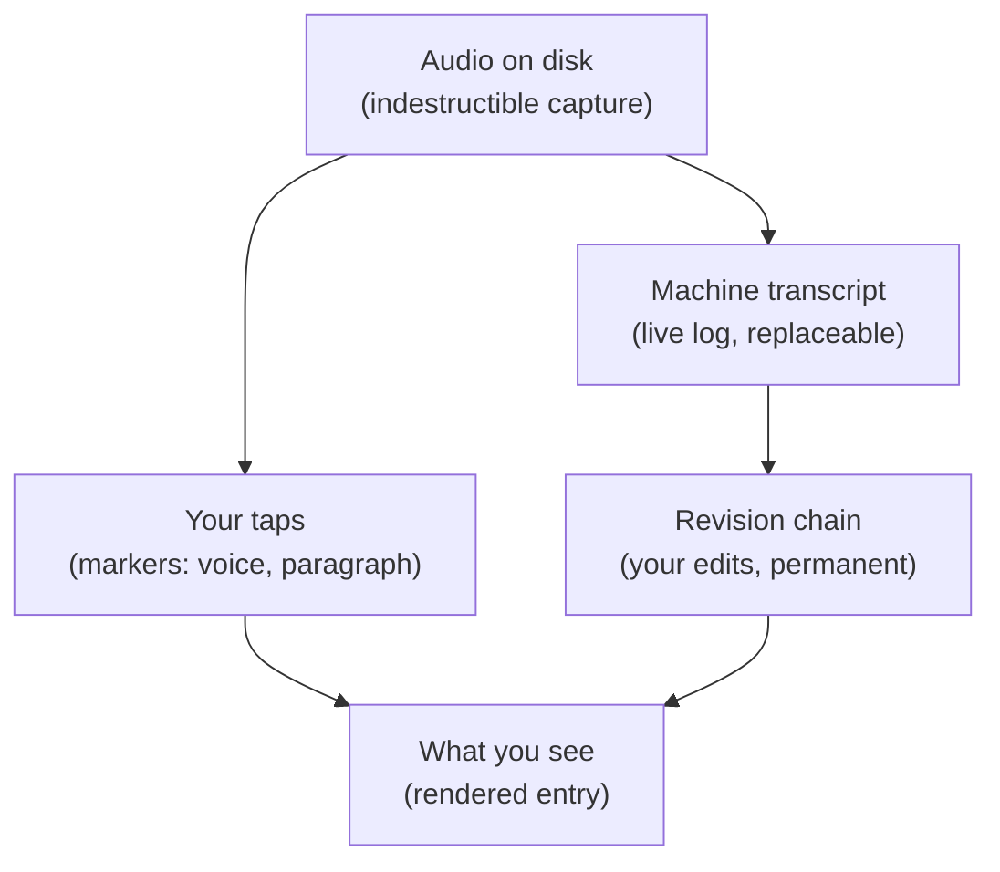
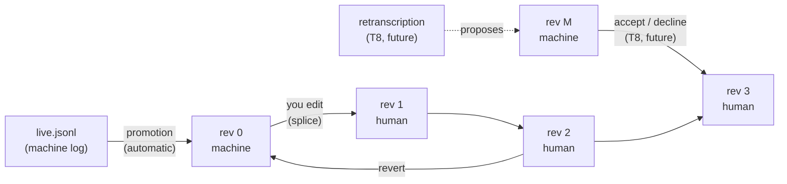
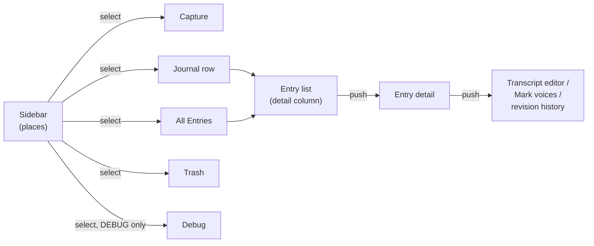
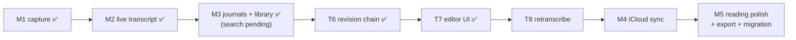

# Raconte — how it works (current plan, plain words)

A map of the system as it stands and where it's going. Mental models only — the
reasoning and history live in the linked design docs. Updated 2026-08-16.

## The one idea

**The audio file is the truth. Everything else — transcript, dates, voices,
paragraphs — is an interpretation of it, and every interpretation can be redone
without losing anything a human did.**

Every design choice below is that idea applied to one more layer.

## The layers



- Lower layers never depend on upper ones. A transcription bug can't hurt audio;
  a rendering bug can't hurt an edit.
- Machine output is always replaceable. Human input (edits, taps, dates) is never
  overwritten by a machine.

## 1. A capture: recording that survives anything

While you record, raw audio is appended to disk in ~20-second chunks. Kill the
app at any instant and at most the last unflushed buffer (≤ 0.2 s) is lost.
When you stop, the chunks are encoded to one `recording.m4a`, and the raw chunks
are deleted only after the m4a is verified playable. If encoding ever fails, the
raw chunks stay — they're playable themselves.

On every launch, a recovery scan walks the capture folders and finishes whatever
was interrupted. Nothing real is ever auto-deleted; you get a "Recovered
recording" banner with Keep as the default.

**The master clock is the frame count** — the running tally of audio samples
since recording began. Marker taps, transcript timestamps, and playback position
all use it, so "second 42 of the transcript" is literally second 42 of the m4a.

Details: [M1 capture design](plans/2026-07-29-m1-capture-design.md)

## 2. An entry: a capture plus your metadata

An entry is a capture directory plus a small `entry.json` sidecar holding what
*you* said about it: which journal it belongs to, its date, whether it's in the
trash, whether it's a two-voice entry. The sidecar is deliberately a separate
file so metadata edits can never disturb the hardened recording machinery.
A missing sidecar just means "all defaults" — never an error.

One capture directory, complete:

```
captures/<id>/                     # id is a ULID — sorts by creation time
  manifest.json                    #   machine state: format, phase, transcript ref
  entry.json                       #   your state: journal, date, trash, voices
  final/recording.m4a              #   the audio — the ground truth
  segments/…                       #   raw chunks (only until encoding finishes)
  transcript/
    live.jsonl                     #   what the machine heard, as it heard it
    markers.jsonl                  #   your taps, raw
    canonical-0.json, -1.json …    #   the revision chain (see §5)
    head.json                      #   cache of "what's current" — disposable
    draft.json                     #   an edit in progress (only while editing)
```

**The library is a scan of these folders — there is no database.** SQLite +
full-text search arrives later (M3 completion) and only ever as a rebuildable
index, never a second source of truth.

**Trash** is a 30-day soft delete: a tombstone in the sidecar, restorable, then
swept. Permanent deletion first renames the whole directory into a staging area
so a half-finished delete can't resurrect an entry. Nothing in the app ever
writes into a trashed or deleted capture.

Details: [M3 dogfood plan](plans/2026-08-02-m3-dogfood-mvp-plan.md),
[staged removal](plans/archive/2026-08-05-staged-removal-build-prompts.md)

## 3. Dates: when it was spoken vs. when it was written

Every entry has two dates:

- **capturedAt** — when you recorded it. Automatic, exact, never edited.
- **originalDate** — the date on the paper page you were reading. Optional,
  edited freely, can be just a year ("1998") or a month ("1998-03"). Stored as
  that string, so timezone math can never shift a year-only date. The library
  browses by this date.

Three things can propose an originalDate: you dialing one in, carry-over from
the previous entry in the same sitting, and a date the app hears spoken at the
start of a recording ("March 4th, 1998"). **Decided rule (partly unbuilt): what
you typed always wins; then what the recording says; then carry-over.** Today
the app doesn't yet record *how* a date arose, so a carried date blocks spoken
detection for the rest of a sitting — that fix (`backdateOrigin`) is designed
but not built.

Details: [backdate precedence](plans/2026-08-03-backdate-precedence-ux.md)

## 4. Markers: your taps are measurements

Your paper journals are two-voice conversations (print vs. cursive — "big Nico"
`bn` and "little Nico" `ln`). No machine can recover which voice is which, so
you mark it live: a **switch-voice** button and an **end-paragraph** button
while recording, each tap confirmed by a haptic (you're looking at the page,
not the screen).

The rule that makes this safe: **a tap is stored as the raw audio frame where it
happened, and it is never modified.** On *read*, taps are snapped to the nearest
silence between words (±0.75 s, tuned from your real tap data). If a better
snapping rule ships later, it re-derives better boundaries from the untouched
raw taps. If there's no gap to snap to, the boundary is kept and flagged
approximate.

Voices are a per-journal "Two voices" toggle, remembered across launches.
Paragraph marking works regardless of the toggle.

Rendering: the detail screen cuts the transcript into paragraphs at every
paragraph tap and every voice switch. **Default is no labels** — the main
voice renders italic, the alternative regular (matches his two-handwriting-
styles paper convention). Labels (e.g. "BN", "LN") are opt-in, set per
journal. Entries with no markers render exactly as before.

Details: [markers design](plans/2026-08-05-capture-structure-markers-design.md),
[voice rendering](plans/archive/2026-08-08-voice-attributed-rendering-plan.md)

## 5. The transcript: a chain of snapshots, and editing it (T6 + T7)

The mental model is closest to **a tiny git for one entry's transcript**:

- A **revision** is a complete snapshot of the transcript text — not a diff.
  It's one immutable file (`canonical-0.json`, `canonical-1.json`, …), written
  once, never edited. Higher file numbers do NOT mean newer.
- Every revision names its **parent**, so revisions form a chain. Two kinds:
  **machine** revisions (the transcriber produced this) and **human** revisions
  (you edited, or you accepted/declined a machine's proposal).
- **"Current" is computed, never stored**: the newest revision on the human
  side of the chain wins. `head.json` just caches that answer — delete it and
  the same answer is re-derived from the revision files.
- If any revision file is unreadable, the entry becomes **read-only** rather
  than letting you edit a version with a sitting silently missing from it.



**Promotion** (automatic, invisible): the live machine log is folded into
revision 0, so the chain always starts from what the machine actually heard.
Runs at finalize, at app launch, and when you open an entry.

**Editing (T7 — built, on `t7/editor-ui`, pending Gate B + PR).** A full-screen,
plain-text editor (Done only — no discard; see revert below for the undo story).
While you type, your text sits in a `draft.json`. When the edit session ends
(done, 90 s idle, 60 min cap, or crash recovery), the draft is **spliced**
against the text you were editing — a diff figures out which pieces you kept
and which you changed — and a new human revision is minted. An unchanged draft
mints nothing. **Voice attribution survives edits** (Task 5): BN/LN paragraph
rendering re-derives from the edited revision's own spans, not just the
untouched machine transcript, so editing a two-voice entry no longer silently
flattens it to one voice.

**Word-level audio anchors.** Each piece of text in a revision (a *span*)
remembers which audio frames it came from, with an honesty grade:

- **exact** — the machine measured these frames for exactly this text
- **inherited** — edited text; frames borrowed from the words it replaced
- **none** — typed from nothing; no audio claim at all

Edits can only *degrade* precision (exact → inherited → none), never invent it.
The one exception: accepting a machine revision adopts its measured anchors
verbatim. This is what will make tap-a-word-to-play-the-audio honest (#13).
One more exception, owner-ruled and shipped (Task 9b): retyping a whole word
with no letters in common ("Ellen" → "LN") **inherits the replaced word's own
frames**. It used to land as a zero-length **inherited** point pinned at the end
of the *previous* word — a real instant, but the wrong one, claiming the
correction happened where the word before it stopped. The retyped word IS the
heard word, corrected, so it keeps that word's stretch of audio. This is
narrowly scoped on purpose: a partial fix inside a word, an edit that swallows
the space beside it, or a deletion spanning two words all stay ordinary edits
and claim nothing. And if the word being replaced had no frames of its own,
neither does the replacement — it never borrows a neighbour's.

**Mark voices (issue #56, replaces "Correct markers").** A separate, explicit
mode: tap a paragraph to flip which voice it is, or drag across a run of
words to mark just that range. Everything renders live as you mark it
(WYSIWYG); Done exits. Unmarked text is implicitly the main voice — you only
mark the parts that are the *other* one, so a fresh entry with no markers at
all is still a valid starting point to mark onto. Raw taps on disk are never
touched: every marking action is an append to `markers.jsonl` (a voice-
carrying boundary, or an "opening voice" record at frame 0 for text before
the first mark), and later appends at the same spot simply win over earlier
ones — no retract, no correct, no read-modify-write. The one thing marking
mode can refuse: a rare post-edit shape where two words share identical audio
frames makes a boundary ambiguous — the app declines rather than guess which
word you meant. Retracting a stray tap and adding a bare paragraph break
(no voice) have no UI for now — the old capability still exists in the format,
just not wired to this screen yet.

**Revision history + revert (T7 Task 8).** A separate screen lists the WHOLE
chain — current, its ancestors, and every detached machine revision, clearly
labeled — and lets you revert to any of them. Revert mints a new revision (nothing
is ever destroyed); it is the editor's entire undo story, since the editor itself
has no discard.

**Metadata audit log (T7 Task 7).** Journal moves, backdates, and trash/restore
are appended to `entry-log.jsonl` — written and exported, no UI yet (deliberate
v1 scope; see §7 of the T6 design).

**Retranscription (T8, future):** a better model re-reads the m4a and proposes a
new machine revision. It never touches your text — you **accept** it (it becomes
current), **decline** it (recorded, stays visible off to the side), or later
**revert** to it using the mechanism T7 already built. All three are just new
revisions; nothing is ever destroyed.

Details: [T6 design](plans/2026-08-03-t6-revision-chain-design.md) (§15/§15b =
T6 as-built rulings, §16 = T7 as-built rulings, §17 = mark-voices as-built),
[T6 build plan](plans/archive/2026-08-08-revision-chain-implementation-plan.md),
[T7 build plan](plans/archive/2026-08-09-t7-editor-ui-plan.md)

## 6. Journals: their own screen, not a capture-time menu

A journal is a name plus an optional **stored span** — the actual date range the paper
journal covers ("1998 – 2001"), set by you, not inferred. It's independent of how much
has been transcribed so far: a journal you've only read the first few pages of should not
advertise itself as "Aug 2026" just because that's when you happened to record it. When a
span is set, it's the one date line shown wherever a journal's dates appear (its sidebar
row, its header); with no span, the app falls back to what the recorded entries
themselves imply, exactly as before.

Two screens now split what used to be crammed into one capture-time menu:

- **The capture picker is selection-only** — pick a journal, or start a new one. That's
  the whole job: "which journal am I recording into right now."
- **Selecting a journal in the sidebar** shows that journal's own header above its entry
  list — cover, name, date line, entry count — and tapping the header pushes the
  **journal editor**: rename, set/replace/remove the cover, edit the span, set per-voice
  labels (§4), and a read-only line showing what's actually in the journal (entry count +
  derived range) beside the span you typed. The sidebar's own `+` creates a journal and
  lands you straight in this editor, since that's the one moment you have the metadata to
  hand.

Splitting these apart also fixed a real bug: the old picker put the cover photo inside a
macOS `Menu`'s label, and on macOS an `Image` inside a `Menu` label renders at its full
intrinsic size rather than the frame SwiftUI gave it — a full-resolution cover photo
covered the whole capture screen and pushed the picker itself off the window. Moving the
cover out of any `Menu` label removes the failure mode outright, not just the symptom.

Entries dated outside their journal's span are meant to get a visible flag — cut from
this build to keep it shorter, tracked separately. The span type and its containment
check already ship; only the two display sites (`LibraryEntryRow`, `EntryDetailView`)
don't yet.

Details: [journal-editing IA design](plans/2026-08-18-journal-editing-ia-design.md).

## 7. Navigation: a sidebar of places (nav — built, on `nav/split-view`, pending Gate B + PR)

The app is one `NavigationSplitView` on both platforms. The sidebar lists **places** —
Capture, one row per journal, All Entries, Trash, and (debug builds only) Debug — and
selecting one shows that place in the detail column. **Capture is selected the moment
the app launches.** On iPhone the split view collapses to a stack whose root is the
places list, so the phone still opens straight into the capture screen exactly as
before; the only visible change is a back chevron that reveals the sidebar. On Mac and
iPad both columns show at once, Mail-style.

While a recording is running, the Capture row in the sidebar shows a live indicator
(red dot + elapsed time) — so a recording started, then navigated away from, is never
invisible. That's deliberate: the coordinator lives at the app root, not inside the
capture screen, so leaving the screen no longer risks the capture.

Inside the detail column, the existing pushes are unchanged in kind: an entry list
pushes to an entry's detail, which pushes to its transcript editor, Mark voices, or
revision history. Back-is-Done still applies to all three — pressing back saves before
leaving (on Mac, ⌘[ walks the list→detail hop).



Two things this replaced, both load-bearing hacks tied to the capture screen's view
lifecycle: the receipt-reconcile rule (clearing a stale "Saved" receipt when its entry
is trashed) and the screen-stays-awake-while-recording rule now both live on the
capture model itself, driven by state, not by a view happening to be on screen. A
third one surfaced only once the screen could be pushed off-mounted: the model's own
dispatch of finished-transcription/finalize-queue work had been running off a
view-mounted hook too, and needed the same fix, or a capture finished while you were
browsing elsewhere would silently never get encoded.

Details: [navigation redesign design](plans/2026-08-17-navigation-redesign-design.md)
(§11 = as-built rulings the design doc didn't anticipate).

## Where the project is



Shipped and dogfooding on the phone and Mac: indestructible capture, live
on-device transcription, journals, backdates with spoken-date detection,
library, trash, markers with voice rendering, the revision chain (T6), and the
editor on top of it (T7 — editing, voice attribution surviving edits, marker
correction, revision history and revert, metadata audit log). Since then: Mark
voices mode for fixing attribution by hand, a fixed capture control bar that a
growing transcript cannot move, and a post-stop receipt that tells you what you
just recorded.

Next, in order:

1. **T8 — retranscription** from the m4a, plus contextual biasing so "LN" stops
   transcribing as "ellen" (#38), and the accept/decline UI T7 left uncalled.
2. **The unified editor** (#60, #59) — one editor showing visible paragraph and
   voice structure, replacing Mark voices mode; undo falls out of it. Two design
   rulings still open.
3. **M4 — CloudKit sync** (private iCloud DB). Done = delete the app, reinstall,
   everything comes back. Only after this: migrate the 36 frozen recountly.org
   entries in and tear the web app down
   ([data model + migration](plans/2026-07-29-data-model-and-migration.md)).
4. **M5 — reading polish**, search, verified open-format export.

Smaller queued work lives in the GitHub issues, not here.

## Reading the docs

The design docs are decision records — they keep their history, superseded
sections and all, which is why they're hard to skim. Rules of thumb:

- **This file** is the current model. When it disagrees with an old doc
  section, a newer amendment (like T6's §15/§15b) usually explains why.
- [plans/README.md](plans/README.md) sorts the rest into living specs, approved-
  but-unbuilt designs, and an archive of executed build recipes.
- The plan of record for milestones is
  [native-rebuild-plan.md](native-rebuild-plan.md); the M3 plan supersedes its
  M3/M4 ordering.
- [user-journeys.md](user-journeys.md) is the intent document — nine
  walk-throughs of how you actually use it.
- Nothing in [plans/archive/](plans/archive/) describes work still to do.
